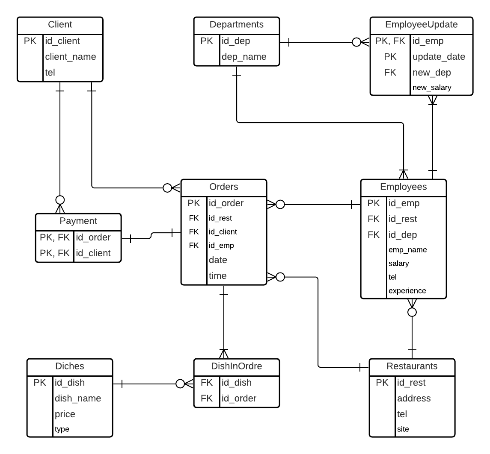

# Сеть ресторанов 

## Логическая модель

## Описание логической модели

`Restaurants` - таблица с данными о ресторанах, номер, адрес, телефон и сайт

`Orders` - таблица с данными о заказах, номер заказа, ресторан, клиент, официант, дата и время

`Departments` - таблица с данными о должностях, номер и название

`Clients` - данные о клиентах, номер клиента, имя и телефон

`Dishes` - данные о блюдах, номер, название, цена и тип

`Employees` - данные о работниках, номер, ресторан, должность, имя, зарплата, телефон, опыт

`Payment` - таблица с данными об оплате заказа, номер заказа и клиент

`DishInOrder` - таблица с данными о блюдах в заказах, номер блюда и номер заказа

`EmployeeUpdate` - таблица с данными о изменениях должности/ зарплаты сотрудников

## Представления

`SumOfClientsOrder` - суммы заказов клиентов.

`AverageSalaryByDepartments` - средняя зарплата по подразделениям.

## Функции

`SumOfOrder (id_ord int)` - по номеру заказа возвращает его сумму, складывает цены всех блюд в заказе.

`MostFrequentClient (date_ date) returns table(name varchar(25), id_client int, orders bigint)` - 
возвращает данные одного из самых частых клиентов, начиная с некоторой даты, например нужна 
для получения каких-то бонусов клиентом.

## Триггер

`EmployeeUpdateTrigger` - при вставке или изменении таблицы employees добавляет данные в таблицу `EmployeeUpdate`

## Роли и права

`Director` - может смотреть таблицу Restaurants, изменять таблицу employees.

`Manager` - может смотреть таблицу employees, изменять таблицу `Orders` и `DishInOrder`.

`Chef` - может изменять таблицу Dishes.
